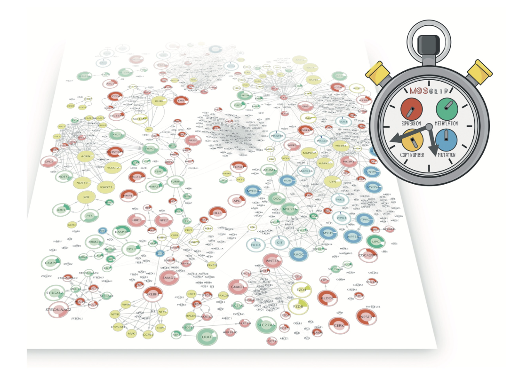

# MOSClip Tutorials
## Welcome to MOSClip tutorial series!

[MOSClip](https://caluralab.github.io/MOSClipTutorials/about.html) is an R package that allows performing multi-omic survival analysis exploiting pathway topology. 

## Start guide

If you are looking for tutorials you are in the right place.

In this section you can find a [series of tutorials](https://caluralab.github.io/MOSClipTutorials):

- [how to download data from TCGA](https://caluralab.github.io/MOSClipTutorials/downloadTCGAData.html)
- [how to format the dataset for MOSClip](https://caluralab.github.io/MOSClipTutorials/formatTCGAdatasets.html) (Needs [functions-to-process-TCGA-data.R](https://caluralab.github.io/MOSClipTutorials/functions-to-process-TCGA-data.R) in the downloadTCGA directory)
- [how to perform a two-class analysis](https://caluralab.github.io/MOSClipTutorials/MOSClip_analysis_TCGA.html)
